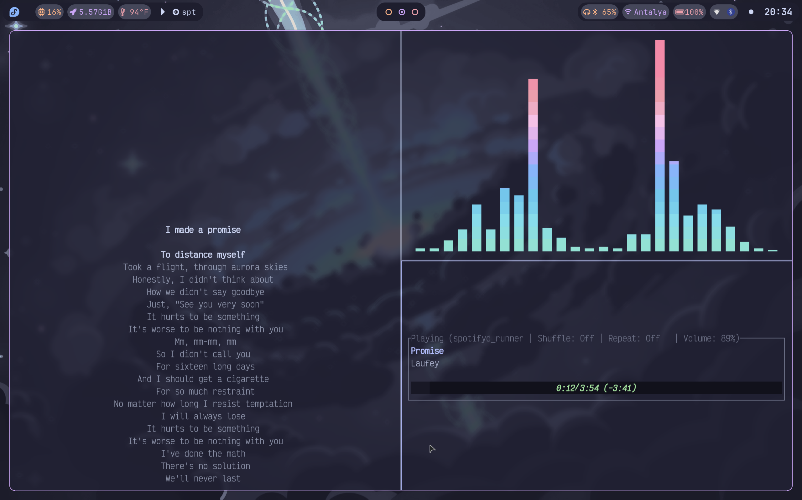
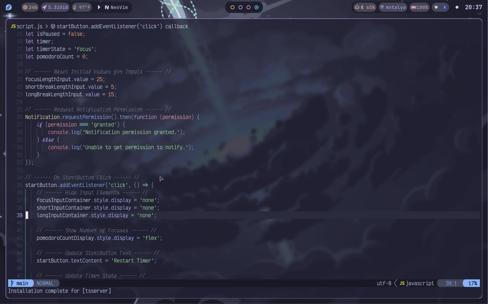
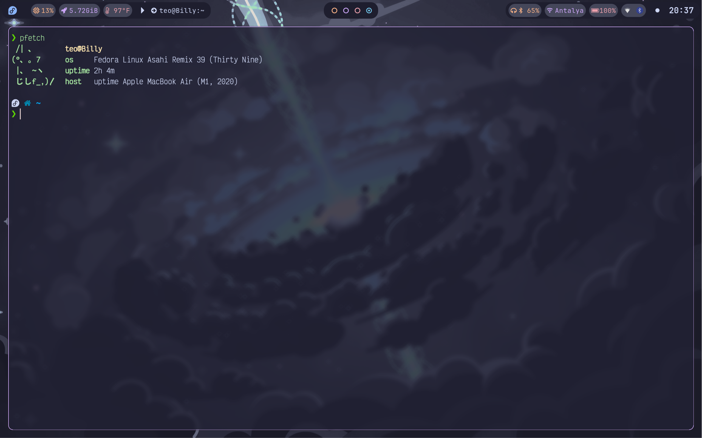

# Dotfiles

## Asahi Linux (Mac M1 Air)

### Screenshots

### Info!

- **Terminal Emulator:** [`kitty`](https://github.com/kovidgoyal/kitty)
- **Shell:** `Zsh`
  - **Plugin Manager:** [`oh-my-zsh`](https://github.com/ohmyzsh/ohmyzsh)
  - **Plugins:**
    - `git`
    - `aliases`
    - `branch`
    - `github`
    - [`powerlevel10k`](https://github.com/romkatv/powerlevel10k)
    - [`zsh-autosuggesttions`](https://github.com/zsh-users/zsh-autosuggestions)
    - [`zsh-syntax-highlighting`](https://github.com/zsh-users/zsh-syntax-highlighting)
    - [`zsh-completions`](https://github.com/zsh-users/zsh-completions)
    - [`zsh-interactive-cd`](https://github.com/mrjohannchang/zsh-interactive-cd)
    - [`zsh-navigation-tools`](https://github.com/z-shell/zsh-navigation-tools)
